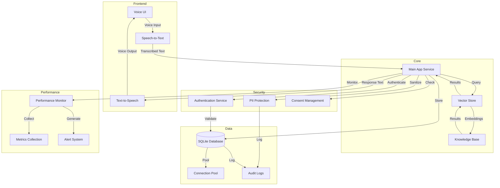

# AI Therapist System Architecture

## Component Responsibilities

### Frontend Layer
- **Voice UI**: User interface for voice interactions
- **Speech-to-Text**: Converts voice input to text using multiple providers
- **Text-to-Speech**: Converts responses to voice output

### Core Layer
- **Main App Service**: Central application logic and request handling
- **Vector Store**: FAISS-based vector storage for embeddings
- **Knowledge Base**: PDF documents and therapy resources

### Security Layer
- **Authentication Service**: JWT-based auth with session management
- **PII Protection**: HIPAA-compliant data sanitization
- **Consent Management**: User consent tracking and enforcement

### Data Layer
- **SQLite Database**: Primary data storage
- **Connection Pool**: Connection management and optimization
- **Audit Logs**: Security and access logging

### Performance Layer
- **Performance Monitor**: System metrics collection
- **Metrics Collection**: Performance data aggregation
- **Alert System**: Performance threshold monitoring

## Key Integration Points

1. **Voice Processing Pipeline**
   - Multiple TTS/STT provider support
   - Fallback mechanisms
   - Audio quality analysis

2. **Security Integration**
   - JWT token validation
   - Role-based access control
   - PII detection and masking
   - HIPAA compliance checks

3. **Data Management**
   - Connection pooling
   - Transaction management
   - Data retention policies
   - Backup mechanisms

4. **Performance Monitoring**
   - Real-time metrics collection
   - Resource utilization tracking
   - Alert generation
   - Historical data analysis

## Non-obvious Architecture Decisions

1. **Voice Processing**
   - Multiple provider support for reliability
   - Local fallback capabilities
   - Streaming support with memory management

2. **Security**
   - PII detection in voice transcriptions
   - Role-based PII masking
   - Comprehensive audit trail
   - Session-based access control

3. **Database**
   - SQLite for simplicity and portability
   - Connection pooling for performance
   - WAL mode for better concurrency
   - Regular cleanup of expired data

4. **Performance**
   - Real-time monitoring with alerts
   - Configurable thresholds
   - Historical metrics retention
   - Resource usage optimization